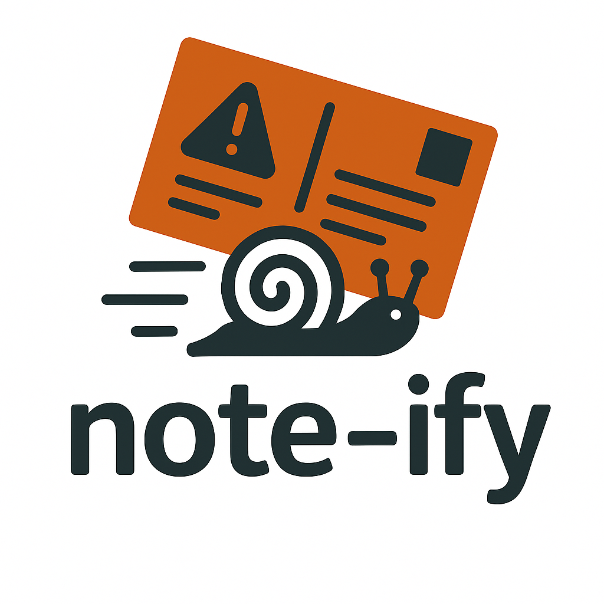

<!-- Improved compatibility of back to top link: See: https://github.com/othneildrew/Best-README-Template/pull/73 -->
<a id="readme-top"></a>
<!--
*** Thanks for checking out the Best-README-Template. If you have a suggestion
*** that would make this better, please fork the repo and create a pull request
*** or simply open an issue with the tag "enhancement".
*** Don't forget to give the project a star!
*** Thanks again! Now go create something AMAZING! :D
-->


<!-- PROJECT SHIELDS -->
<!--
*** I'm using markdown "reference style" links for readability.
*** Reference links are enclosed in brackets [ ] instead of parentheses ( ).
*** See the bottom of this document for the declaration of the reference variables
*** for contributors-url, forks-url, etc. This is an optional, concise syntax you may use.
*** https://www.markdownguide.org/basic-syntax/#reference-style-links
-->
[![Contributors][contributors-shield]][contributors-url]
[![Forks][forks-shield]][forks-url]
[![Stargazers][stars-shield]][stars-url]
[![Issues][issues-shield]][issues-url]
[![project_license][license-shield]][license-url]
[![LinkedIn][linkedin-shield]][linkedin-url]


<!-- PROJECT LOGO -->
<br />
<div align="center">
  <a href="https://github.com/zjpiazza/note-ify">
    
  </a>

<h3 align="center">note-ify</h3>

  <p align="center">
    Server Alerts... By Postal Mail! 📬 Send physical postcards summarizing your Prometheus alerts, because nothing says "your server was down last week" like finding out about it in your mailbox today!
    <br />
    <a href="https://github.com/zjpiazza/note-ify"><strong>Explore the docs »</strong></a>
    <br />
    <br />
    <a href="https://github.com/zjpiazza/note-ify">View Demo</a>
    &middot;
    <a href="https://github.com/zjpiazza/note-ify/issues/new?labels=bug&template=bug-report---.md">Report Bug</a>
    &middot;
    <a href="https://github.com/zjpiazza/note-ify/issues/new?labels=enhancement&template=feature-request---.md">Request Feature</a>
  </p>
</div>


<!-- TABLE OF CONTENTS -->
<details>
  <summary>Table of Contents</summary>
  <ol>
    <li>
      <a href="#about-the-project">About The Project</a>
      <ul>
        <li><a href="#built-with">Built With</a></li>
      </ul>
    </li>
    <li>
      <a href="#getting-started">Getting Started</a>
      <ul>
        <li><a href="#prerequisites">Prerequisites</a></li>
        <li><a href="#installation">Installation</a></li>
      </ul>
    </li>
    <li><a href="#usage">Usage</a></li>
    <li><a href="#roadmap">Roadmap</a></li>
    <li><a href="#contributing">Contributing</a></li>
    <li><a href="#license">License</a></li>
  </ol>
</details>


<!-- ABOUT THE PROJECT -->
## About The Project

<!-- TODO -->
<!-- [![Product Name Screen Shot][product-screenshot]](https://example.com) -->

note-ify is a deliberately impractical and humorous service that sends physical postcards summarizing Prometheus server alerts via postal mail. Instead of instant notifications, it offers a nostalgic and slow approach to monitoring with the following ridiculously impractical features:
- **Physical Postcards**: Receive tangible postcards summarizing alerts from days or weeks ago, ideal for sysadmins who appreciate a retro vibe.
- **Delightfully Slow Delivery**: Experience delays of 3-5 business days (or more) to learn about past outages, adding a thrilling element of surprise.
- **Weekly/Monthly Summaries**: Choose between weekly or monthly postcard updates, which arrive long after issues are resolved or consequences faced.

<p align="right">(<a href="#readme-top">back to top</a>)</p>


### Built With

* [](#)
* [](#)

<p align="right">(<a href="#readme-top">back to top</a>)</p>


<!-- GETTING STARTED -->
## Getting Started

This is an example of how you may give instructions on setting up your project locally.
To get a local copy up and running follow these simple example steps.

### Prerequisites

This is an example of how to list things you need to use the software and how to install them.
* Elixir
  ```sh
  # Instructions for installing Elixir can be found at https://elixir-lang.org/install.html
  ```

### Installation

1. Clone the repo
   ```sh
   git clone https://github.com/zjpiazza/note-ify.git
   ```
2. Install dependencies
   ```sh
   mix deps.get
   ```
3. Configure your Alertmanager connection in `config/config.exs`
   ```elixir
   config :note_ify, :alertmanager,
     url: "YOUR_ALERTMANAGER_URL"
   ```
4. Start the application
   ```sh
   mix run --no-halt
   ```

<p align="right">(<a href="#readme-top">back to top</a>)</p>


<!-- USAGE EXAMPLES -->
## Usage

Use note-ify to receive physical postcards summarizing your server alerts. Here's how it works:
1. **Connect to Alertmanager**: Our Elixir app connects to your Prometheus Alertmanager and collects critical alerts.
2. **Delayed Notification**: Alerts are stored until your chosen summary day (weekly or monthly).
3. **Physical Printing**: Alerts are formatted onto a postcard, printed on paper, and prepared for mailing.
4. **Snail Mail Delivery**: Postcards are sent through the postal system, taking 3-7 days to reach you.

Join our small group of people who thought this was funny enough to try!

_For more examples, please refer to the [Documentation](https://example.com)_

<p align="right">(<a href="#readme-top">back to top</a>)</p>


<!-- ROADMAP -->
## Roadmap

- [ ] Go live with beta

See the [open issues](https://github.com/zjpiazza/note-ify/issues) for a full list of proposed features (and known issues).

<p align="right">(<a href="#readme-top">back to top</a>)</p>


<!-- CONTRIBUTING -->
## Contributing

Contributions are what make the open source community such an amazing place to learn, inspire, and create. Any contributions you make are **greatly appreciated**.

If you have a suggestion that would make this better, please fork the repo and create a pull request. You can also simply open an issue with the tag "enhancement".
Don't forget to give the project a star! Thanks again!

1. Fork the Project
2. Create your Feature Branch (`git checkout -b feature/AmazingFeature`)
3. Commit your Changes (`git commit -m 'Add some AmazingFeature'`)
4. Push to the Branch (`git push origin feature/AmazingFeature`)
5. Open a Pull Request

<p align="right">(<a href="#readme-top">back to top</a>)</p>


<!-- LICENSE -->
## License

Distributed under the project_license. See `LICENSE.txt` for more information.

<p align="right">(<a href="#readme-top">back to top</a>)</p>

<!-- MARKDOWN LINKS & IMAGES -->
<!-- https://www.markdownguide.org/basic-syntax/#reference-style-links -->
[contributors-shield]: https://img.shields.io/github/contributors/zjpiazza/note-ify.svg?style=for-the-badge
[contributors-url]: https://github.com/zjpiazza/note-ify/graphs/contributors
[forks-shield]: https://img.shields.io/github/forks/zjpiazza/note-ify.svg?style=for-the-badge
[forks-url]: https://github.com/zjpiazza/note-ify/network/members
[stars-shield]: https://img.shields.io/github/stars/zjpiazza/note-ify.svg?style=for-the-badge
[stars-url]: https://github.com/zjpiazza/note-ify/stargazers
[issues-shield]: https://img.shields.io/github/issues/zjpiazza/note-ify.svg?style=for-the-badge
[issues-url]: https://github.com/zjpiazza/note-ify/issues
[license-shield]: https://img.shields.io/github/license/zjpiazza/note-ify.svg?style=for-the-badge
[license-url]: https://github.com/zjpiazza/note-ify/blob/master/LICENSE.txt
[linkedin-shield]: https://img.shields.io/badge/-LinkedIn-black.svg?style=for-the-badge&logo=linkedin&colorB=555
[linkedin-url]: https://linkedin.com/in/linkedin_username
[product-screenshot]: images/screenshot.png
[Elixir]: https://img.shields.io/badge/Elixir-4B275F?style=for-the-badge&logo=elixir&logoColor=white
[Elixir-url]: https://elixir-lang.org/